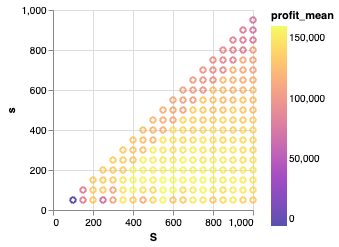

# Inventory-Optimization

## Executive Summary

The report proposes an optimized inventory policy to maximize profit and ensure product availability. The strategy follows the periodic control inventory management method:  
- Each time the inventory is lower than the level **s** (reorder point), place an order to bring the inventory up to level **S** (order-up-to level).  
- This saves checking costs and simplifies management.

**Optimal strategy:**
- Reorder point (**s**): 165 units
- Order-up-to level (**S**): 575 units
- Expected annual profit: ~EUR 161,000  
- Low financial risk  
- Recommend quarterly review for continuous improvement.

This policy will help **SAIGON BEERS CO.** increase profit while minimizing risk and maintaining product availability.

---

## Description of Business

- **Company Name:** SAIGON BEERS CO  
- **Business Type:** Beverage industry (beer production and sales)  
- **Products/Services:** Premium to mass-market beer products  
- **Organization Size:** Medium-to-large, operating in Vietnam and planning regional expansion  
- **Market Type:** Monopolistic competition  
- **Main Competitors:** Heineken Vietnam, SABECO, local craft brands  

---

## Description of the Problem

### Business Issue

SAIGON BEERS CO needs to efficiently manage beer inventory to:
- Maximize profit  
- Avoid stockouts  
- Minimize holding costs  

Key decision: Choose optimal (s, S) inventory policy

- **s**: Reorder point (triggering order)
- **S**: Order-up-to level

### Stakeholder Expectations

#### Chief Operating Officer (COO)
- Ensure product availability
- Minimize reordering disruptions
- Be responsive to demand spikes (holidays, festivals)

#### Chief Financial Officer (CFO)
- Minimize holding & ordering costs
- Reduce tied-up capital
- Maximize profit while controlling risks
  
---
### Feasible Set of Decisions

- **Decision variables:** s (reorder point), S (order-up-to level)

**Constraints:**
- Warehouse Capacity: `S ≤ 1000`
- Minimum Safety Stock: `s ≥ 100`
- Beer Shelf Life: `S ≤ 600` (practical)
- Reasonable Order Size: `S - s ≈ 300–500`

---

### Objective Function

**Goal:** Maximize profit = revenue – inventory cost – ordering cost – stockout cost

```math
∑_{j=1}^{m} [ c·min(Dj, Xj) - h·Yj - Kj - k·(S - Yj) - l·max(0, Dj - Xj) ]
```
Where:
- **Dj**: demand at day *j* (Poisson distributed)
- **Xj**: inventory level at day *j*
- **Yj**: leftover inventory at end of day *j* (`max(0, Xj - Dj)`)
- **K**: fixed cost per order (€)
- **k**: variable cost per bottle ordered (€)
- **c**: profit per bottle sold (€)
- **h**: holding cost per bottle per day (€)
- **l**: penalty cost per bottle lost due to stockout (€)

### Consequences of Decisions
- Profit: Optimized (s, S) improves profitability
- Risk:
- -Too low s/S → stockouts, lost sales
- -Too high S → high holding costs, risk of spoilage

---

## Results and Analysis

The numerical results indicate that the optimal inventory policy is to set the reorder point **s** at **165 units** and the order-up-to level **S** at **575 units**. Under this strategy, the **expected annual profit is approximately €161,000**.

The process of looking for the above optimal solution can be shown using the tables and figures below:

**Table 1: Optimal s, S for the highest expected profit in the 1st simulation**

| Best (s, S) | Mean profit (€) | Profit std | Stock out bottles | Stock out std | Fill rate (%) |
|-------------|------------------|------------|--------------------|----------------|----------------|
| (165, 575)  | 161,016.7        | 2,931.1    | 15,348.8           | 222.3          | 91.96%         |

**Figure 1: Simulation results of (s, S) for 1st simulation**


To further validate the robustness of the solution, we repeated the simulation multiple times. The performance of the best parameters remained consistent across simulations, which strengthens the confidence in the recommended inventory policy.

We also analyzed the **service level**, measured as the fill rate, which was **approximately 92%**, indicating a high level of customer satisfaction.

**Table 2: Summary of simulations (s=165, S=575)**

| Run | Profit (€) | Stockouts | Fill Rate (%) |
|-----|------------|-----------|----------------|
| 1   | 161,017    | 15,349    | 91.96%         |
| 2   | 160,825    | 15,411    | 91.84%         |
| 3   | 161,090    | 15,300    | 92.00%         |
| ... | ...        | ...       | ...            |

The results demonstrate that using a stochastic (s, S) inventory policy enables the company to handle uncertain daily demand effectively while keeping holding costs and lost sales penalties in check.

## Conclusion

We developed a stochastic inventory model for a beverage distributor, with the goal of maximizing profit under uncertain daily demand. The demand was modeled using a Poisson distribution, and the inventory policy was formulated as an (s, S) policy.

Simulation-based optimization helped us identify the optimal values of **s = 165** and **S = 575**, achieving a high expected annual profit and a service level above **91%**.

This model provides a data-driven decision support tool that balances inventory investment with customer satisfaction, ensuring that the company operates efficiently and profitably.
